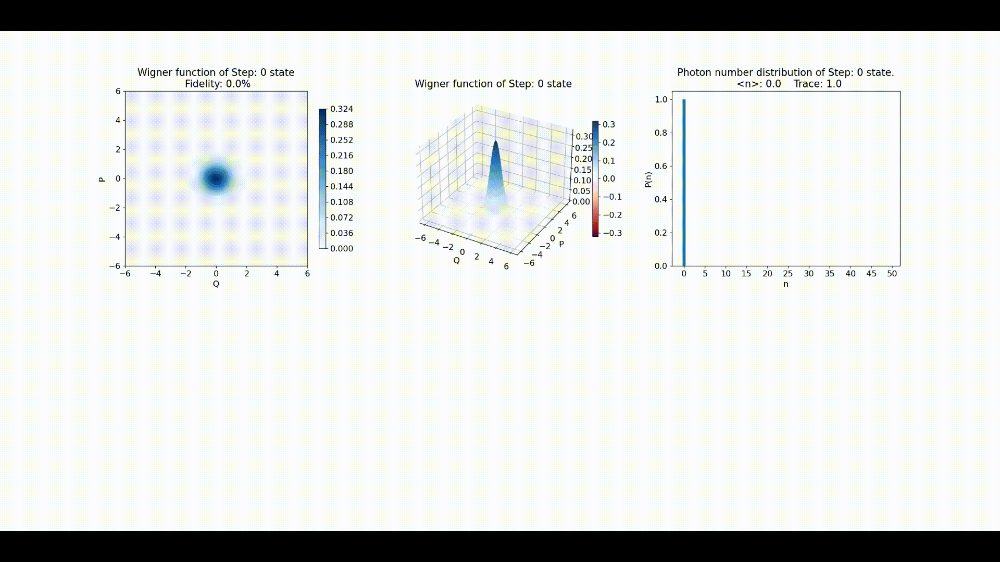

# Deep reinforcement learning for quantum state engineering by Gaussian catalysis (GBS)

Deep reinforcement learning code for optimizing Gaussian catalysis (GBS) to engineer exotic quantum states of light.

This is the supporting code for the results presented in the paper I co-authored *Machine learning for efficient generation of universal hybrid quantum computing resources* avaialbe here: [**https://arxiv.org/abs/2301.01232v2.**](https://arxiv.org/abs/2310.03130)

We use the Proximal Policy Optimization algorithm to train an agent to learn how to prepare certain types of quantum states, such as fock states and cat states, via the process of Gaussian catalysis (GBS) which consists of interfering squeezed vacuum states of light as inputs with an initial squeezed vacuum state at a beamsplitter followed by a photon number resolving detection on one of the output modes.
